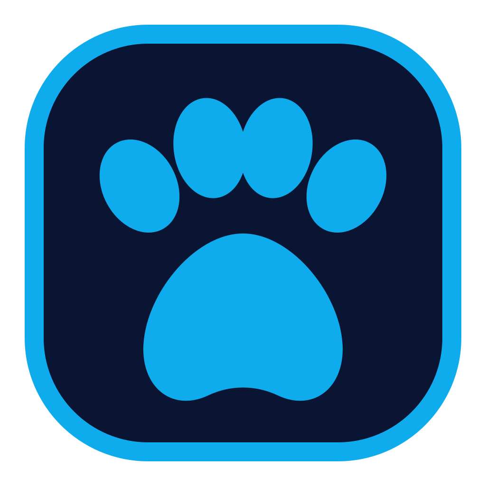

# SonaPin - Your Fursona Badge, Alive



SonaPin turns an iPhone into an interactive fursona badge for conventions,
meetups, and everyday introductions. It combines an expressive 3D avatar,
the profile details you choose, and a scannable QR code in one local-first app.

Your sona. Your badge. Alive.

## Features

- **Interactive avatar** - Display a 3D fursona and explore it with touch
  gestures and supported expressions.
- **Personal badge** - Share a display name, pronouns, short bio, and optional
  links from one focused screen.
- **Scannable QR code** - Create and enlarge a high-contrast QR code with
  selectable error correction.
- **VRM import** - Import compatible VRM files from the Files app and review
  plain-language compatibility notes.
- **Local-first privacy** - Keep profile data and imported avatars on-device,
  with no account, ads, analytics, tracking, or backend.
- **Accessible controls** - Adjust motion, haptics, interaction sensitivity,
  screen-awake behavior, and visual contrast.

## Getting Started

Read the [project documentation](docs/) or visit the
[SonaPin website](https://mrdemonwolf.github.io/sonapin/) for release updates.

1. Clone the repository.
2. Install JavaScript dependencies with `bun install`.
3. Generate the Xcode project with `make project`.
4. Launch the app in an iPhone Simulator with `make sim`.

## Usage

SonaPin is coming soon to the iOS App Store. The public website provides the
latest project, privacy, support, terms, and acknowledgment information.

For local development, launch the native app with:

```bash
make sim
```

Build the public website with:

```bash
bun run build
```

## Tech Stack

| Layer | Technology |
| --- | --- |
| Native app | Swift 6, SwiftUI, Observation, RealityKit |
| Avatar support | VRMKit 0.10.0 |
| Website | TypeScript, HTML, CSS, Bun |
| Project generation | XcodeGen, Make |
| Testing | Swift Testing, XCUITest, Playwright |
| Delivery | GitHub Actions, GitHub Pages |

## Development

### Prerequisites

- macOS 26.4 or later
- Xcode 26.6
- XcodeGen 2.46 or later
- Bun 1.4 or later
- SwiftLint, optional

Xcode 26 is required because the app icon uses Apple's Icon Composer format.

### Setup

1. Install dependencies.

   ```bash
   bun install
   ```

2. Generate the Xcode project.

   ```bash
   make project
   ```

3. Build the iOS app for Simulator.

   ```bash
   make build
   ```

4. Build the public website.

   ```bash
   bun run build
   ```

### Development Scripts

- `bun run build` - Build the public website.
- `bun run build:docs` - Build the public website from `apps/docs`.
- `bun run test:e2e` - Run the Playwright end-to-end suite.
- `make project` - Generate the Xcode project with XcodeGen.
- `make build` - Resolve Swift packages and build for iOS Simulator.
- `make test` - Run native unit tests.
- `make ui-test` - Run native UI tests.
- `make sim` - Build, install, and launch SonaPin in Simulator.
- `make lint-check` - Run native lint checks.
- `make docs-build` - Build the public website.
- `make clean` - Remove native and website build output.

### Code Quality

- Swift strict concurrency checks and warnings-as-errors
- Native unit and UI tests with coverage collection
- Playwright end-to-end checks for the public website
- SwiftLint checks when SwiftLint is installed
- GitHub Actions checks for native builds, E2E tests, and Pages deployment

## Project Structure

```text
.
|-- .github/workflows/  # CI, E2E, and GitHub Pages workflows
|-- apps/
|   |-- docs/           # Public static website and legal pages
|   `-- native/         # SwiftUI iOS app, tests, and XcodeGen config
|-- assets/brand/       # Shared SonaPin brand artwork
|-- docs/               # Engineering, release, and review documentation
|-- scripts/            # Simulator, test, and lint helpers
|-- tests/e2e/          # Playwright website tests
|-- Makefile            # Native and website developer commands
`-- package.json        # Bun workspace and root scripts
```

## License


Copyright (C) 2026 MrDemonWolf, Inc. SonaPin is licensed under the
[GNU General Public License v3.0 or later](LICENSE).

## Contact

- Discord: [Join my server](https://mrdwolf.net/discord)
- Website: [mrdemonwolf.com](https://www.mrdemonwolf.com)
- GitHub: [MrDemonWolf](https://github.com/MrDemonWolf)

Made with love by [MrDemonWolf, Inc.](https://www.mrdemonwolf.com)
